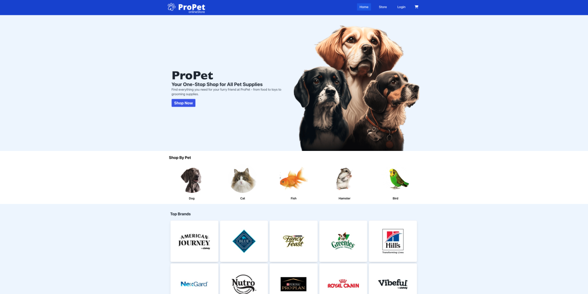

## Hi there 👋, my name is Raul

I am a Full Stack Developer with a passion for creating innovative and user-friendly web applications. My skills include proficiency in various programming languages such as JavaScript, Python, and HTML/CSS, as well as experience with popular frameworks such as React and Node.js. I am always eager to learn new technologies and stay up-to-date with industry trends. I am a problem-solver at heart and strive to create elegant solutions for complex challenges.

## Languages and Tools

## My Portfolio

## My Projects

#### ConnectME | Social Media App  
[GitHub](https://github.com/jimenezraul/social-media)  
  
#### BookMe | Scheduling App | Square API  
[GitHub](https://github.com/jimenezraul/BookMe)  
  
#### Barber Scheduling App | Setmore API  
[GitHub](https://github.com/jimenezraul/BarberSchedulingApp)  
  
#### ProPet | E-commerce  
[GitHub](https://github.com/jimenezraul/pet-supplies-store)  
  
#### Inventory Management System  
[GitHub](https://github.com/jimenezraul/IMS)  
  
#### The Tech Blog  
[GitHub](https://github.com/jimenezraul/mvc-tech-blog)  
  
#### CoinHiz  
[GitHub](https://github.com/jimenezraul/coinhiz)  

## My NPM Packages

[Auto-Hide-Hook](https://www.npmjs.com/package/auto-hide-hook)    
[uFetch-Hook](https://www.npmjs.com/package/ufetch-hook)      
[IndexedDBPromise](https://www.npmjs.com/package/indexeddbpromise)   
[Auth](https://www.npmjs.com/package/@jimenezraul/auth)    
[Form Validation](https://www.npmjs.com/package/@jimenezraul/form-validation)    
[Setmore-SDK](https://www.npmjs.com/package/setmore-sdk) 

## ContactMe

## Certifications

   
   

## Stats

